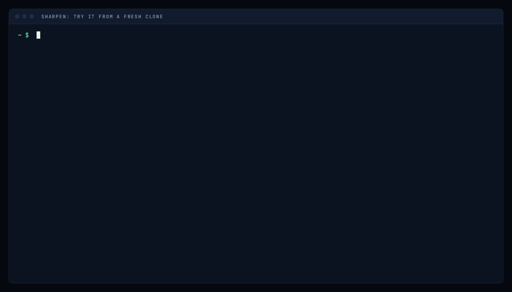
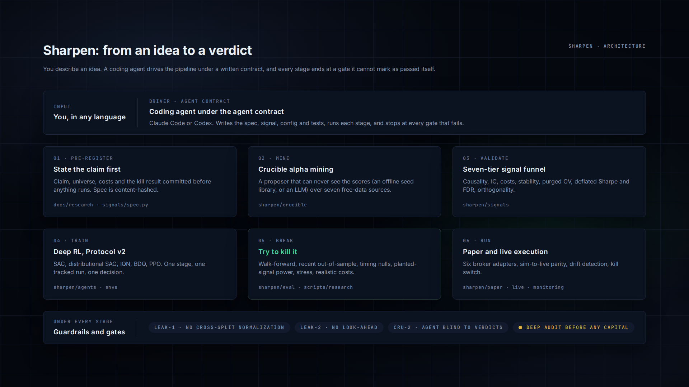
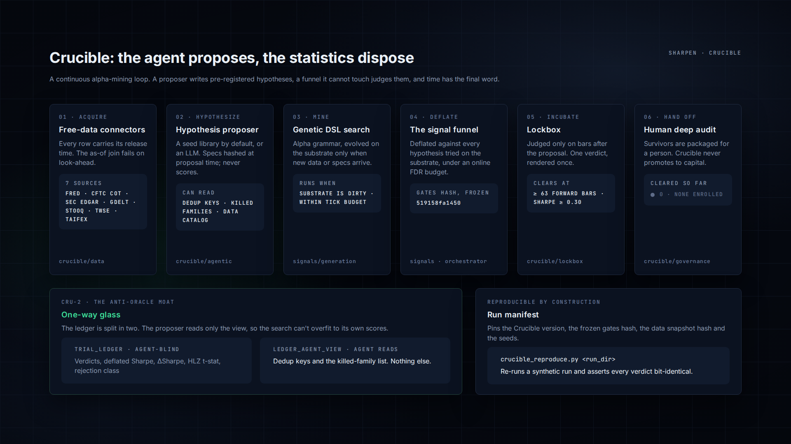

# Sharpen

[](https://ko-fi.com/bigcan)

Sharpen is an agentic-AI, full-featured quant strategy builder — from a concept to a validated, trained and deployment-ready system.



<sub>A real run from a fresh clone of this repository. Waits are skipped ahead and labelled; the output is unedited.</sub>

**Describe what you want in any natural language. Sharpen turns it into a pre-registered spec,
writes the signal and the tests, trains it, and then tries to break it — with every result
deflated for the number of things you tried.**

Sharpen is built to be driven by an AI coding agent such as Claude Code or Codex. The rules the
agent follows ship in the repository ([CLAUDE.md](CLAUDE.md)): how to
turn an idea into a pre-registered spec, which gates it must pass, how RL training is staged, and
what must never happen (look-ahead, cross-split normalization, fused train-and-evaluate runs). You
say what you want, in whatever language you work in; the agent writes the signal, the config and
the tests, runs the pipeline, and stops at every gate that fails.

Underneath is a full research-to-execution stack:

- **A seven-tier validation funnel** that deflates every result for the number of things you tried.
- **A full backtesting and falsification toolkit**: walk-forward and recent out-of-sample
  backtests, realistic costs, timing nulls, planted-signal power tests, stress and noise
  robustness. Its job is to try to break a strategy before the market does.
- **Crucible**, an automated **alpha mining** platform in which an LLM proposes hypotheses it can never
  see the scores of.
- **A frontier deep-RL stack**: distributional SAC, CrossQ, IQN, BDQ and PPO, multi-asset and
  execution environments, distributed GPU hyper-parameter search, and a staged training protocol.
- **Paper and live execution** across six broker adapters, with monitoring, drift detection and a
  kill switch.



> **Not investment advice. Not a trading product.** Every performance figure in this repository
> comes from a historical simulation or a paper run. Read [DISCLAIMER.md](DISCLAIMER.md).

---

## From a concept to a strategy

Here is the end-to-end path, as you would drive it from a coding agent. Each step names what you
ask, what the agent does, and the gate that decides whether you go on. The requests are shown in
English, but you can write them in any language.

**1. State the idea.**
> *"Test whether 12-month time-series momentum on liquid ETFs across equities, bonds, commodities
> and currencies survives costs."*

The agent writes a pre-registration under `docs/research/`: the claim, universe, horizon, cost
model and the result that would kill it. It commits this **before** running anything, and the
signal spec is content-hashed so it can't be quietly edited after the results are in.

**2. Build and validate the signal.**
> *"Build it as a signal and run it through the validation funnel."*

The agent implements a `compute(panel)` signal and scores it through the funnel:

```bash
python scripts/research/eval_signals.py --batch <batch> --panel <panel> --out results/<run>
```

You get a scorecard with information coefficient, net Sharpe at each cost level, deflated Sharpe,
false-discovery q-value and purged cross-validation, plus a verdict. Only `PROMISING` goes on.

**3. Try to break it.**
> *"Falsify it: does the rule know* when *to trade, or would random timing do as well? Could this
> test even detect an edge of this size?"*

The agent runs the falsification battery: a circular-shift timing null, a power check that
measures the smallest edge the test can detect, and cost and stress sweeps. A strategy that loses
to randomly re-timed copies of its own trades is closed here, not in production.

**4. Let the machine mine alphas for you** (optional).
> *"Run Crucible on the synthetic substrate for four nights."*

```bash
python scripts/research/crucible_orchestrator.py --mode synthetic --nights 4 --force
```

Crucible runs continuous alpha mining on its own: it proposes, mines, deflates and
forward-incubates candidates, and forward-tests survivors only on bars that postdate the
hypothesis.

**5. Build a portfolio.**
> *"Combine the validated sleeves into a volatility-targeted book and check whether it's
> overfit."*

The book is assembled and put through deflated Sharpe and probability-of-backtest-overfitting
checks (`scripts/research/audit_tailwind_book.py` is a worked example).

**6. Train an RL strategy on top.**
> *"Train a SAC overlay that has to beat the linear book out of sample."*

The agent writes a config from a reference YAML and runs Protocol v2, one stage and one tracked run
at a time. Each stage writes a manifest the next stage checks:

```bash
python scripts/validate_config.py  --config configs/<cfg>.yaml --stage hpo
python scripts/run_full_pipeline.py --config configs/<cfg>.yaml --stage hpo --agent sac
# then: l1-multiseed -> ensemble-confirm -> wf -> oos -> paper-deploy
```

**7. Deploy to paper, then watch it.**
> *"Deploy the ensemble to the paper account and alert me if it drifts."*

The paper-portfolio executor, parity harness and Docker stack (Prometheus, Grafana, Telegram)
take over. Drift detection and a kill file guard the live path.

The step-by-step guide, with every gate spelled out, is
[docs/guides/building-a-strategy.md](docs/guides/building-a-strategy.md).

---

## Features

### Agent-driven workflow
- **Rules the agent actually follows.** [CLAUDE.md](CLAUDE.md) encodes the invariants, the
  training protocol, the config schema and the audit chain. Every rule in it was written after
  something went wrong.
- **Deterministic gates, not self-review.** Config validation, the OHLCV cleaner, pytest, ruff and
  cross-checked profit factors are tool executions the agent must pass. It can't mark its own work
  as done.
- **A deep lifecycle audit** workflow (`.claude/workflows/deep_strategy_audit.js`) runs a finder
  agent and a skeptic agent per pillar before anything is promoted.

### Signal validation funnel — `sharpen/signals/`
Signals are pre-registered, content-hashed specs. Each tier catches a different way a backtest
lies:

| Tier | Test |
|---|---|
| 0 | Causality (truncation tripwire), OHLC hygiene, coverage |
| 1 | Multi-horizon IC, decile spread, breadth, decay half-life |
| 2 | Capturability: net Sharpe per cost model, cost wall, turnover |
| 3 | Subperiod stability and recent out-of-sample |
| 3.5 | Combinatorial purged path resampling with embargo |
| 4 | Deflated Sharpe, effective N, FDR/BHY, Harvey-Liu-Zhu hurdle |
| 5 | Orthogonality to a factor book (residual Sharpe) |

Signal libraries: WorldQuant 101, TradingView indicators, a demo set, and a genetic DSL search
(`sharpen/signals/generation/`) with cohort-level Monte-Carlo null gating.

### Crucible: automated alpha mining — `sharpen/crucible/`
Systematic alpha mining with validation inside the loop.



- **LLM hypothesis proposer** (`agentic/llm_proposer.py`, uses the Claude API). It turns
  natural-language priors into pre-registered specs. It is **structurally blind to scores**: the
  module can't reach any verdict, so the search can't overfit to its own results.
- **Free-data connectors**: FRED, CFTC COT, SEC EDGAR, GDELT, Stooq, TWSE, TAIFEX.
- **Mine, deflate, incubate**: every candidate is deflated against everything the search has ever
  tried, then forward-incubated in a lockbox.
- **Reproducible**: gate definitions are hash-frozen, and every run records its provenance.

### Backtesting and falsification
A backtest shows what a strategy did. These tools test whether it would do it again.

| Tool | What it answers |
|---|---|
| **Walk-forward + recent OOS** (Protocol v2 `wf`, `oos` stages) | Does the edge hold across rolling folds and on the newest unseen data, with bootstrap confidence intervals? |
| **Realistic costs** (`sharpen/signals/costs.py`) | Standard and harsh per-market cost models, and the cost level at which the edge disappears |
| **Circular-shift timing null** (`scripts/research/hma_cross_falsification.py`) | Keeps exposure, trade count and holding periods, shifts the timing. Does the rule know *when* to trade? |
| **Edge-sign flip + matched exposure** (`scripts/research/risk_overlay_lab.py`) | Is a risk overlay adding skill, or just de-levering? |
| **Planted-signal power** (`planted_sweep.py`, `forward_power.py`) | What is the smallest edge this test can detect with this much data? |
| **Matched-null search** (`null_grid_sim.py`, `crucible_matched_null.py`) | What does the same search find on data with no signal at all? |
| **Gate reachability** (`execution_overlay_action_ceiling.py`) | Could *any* policy in this action space clear the gate? Answer it before spending GPU hours |
| **Multiplicity accounting** (`sharpen/signals/multiplicity.py`) | Deflates against every hypothesis tested, however the batches were split |
| **Deflated Sharpe + PBO** (`audit_tailwind_book.py`) | Is a portfolio's Sharpe explained by how many variants were tried? |
| **Stress and robustness** (`sharpen/eval/`) | Fixed-lot drawdown stress, price-path noise, and config-sensitivity sweeps on a frozen policy |
| **Profit-factor cross-check** (agent rule `PF-XCHECK`) | The agent recomputes PF from both mid price and close, and stops if they diverge by more than 30% |

### Frontier deep RL — `sharpen/agents/`, `sharpen/envs/`
| Agents | |
|---|---|
| **SAC** | Continuous control with CrossQ-style Batch Renormalization critics, an ensemble wrapper for live inference, regime-balanced replay |
| **Distributional SAC** | Quantile-regression critics for risk-aware sizing |
| **IQN** | Implicit quantile networks: learns the full return distribution |
| **BDQ** | Branching dueling Q-networks for multi-dimensional discrete actions |
| **PPO** | Continuous and discrete variants |

| Environments | |
|---|---|
| Continuous swing | Single-asset directional trading with differential-Sharpe reward and a deadband |
| Multi-asset allocator | Cross-asset book; the agent modulates a vol-targeted linear core it must beat out of sample |
| Execution scheduler | RL that shapes the trade path to cut implementation shortfall |
| Market making | Spread, skew and intensity control on limit-order-book data |
| Wrappers | Signal-gated trading, risk shaping and prop-firm constraints, observation guards |

**Training engineering**: `torch.compile`, mixed precision, mega-batch updates with tunable
update-to-data ratio, and Tensor-Core-aligned networks. **Distributed Optuna HPO** runs across GPU
fleets (`scripts/distributed_hpo_coordinator.py`, `distributed_hpo_worker.py`), with
bare-metal and Vast.ai deploy scripts.

**Protocol v2** stages every RL project as
`data-prep → hpo → l1-multiseed → ensemble-confirm → wf → oos → paper-deploy`. Each stage is one
tracked WandB run that produces one decision artifact, and `validate_config.py` rejects fused
pipelines and leaky configs before a GPU spins up. See [docs/protocol_v2.md](docs/protocol_v2.md).

### Execution and operations — `sharpen/paper/`, `sharpen/live/`, `docker/live/`
- **Six broker adapters**: Bybit perpetuals, ccxt exchanges, DXtrade, Interactive Brokers futures,
  cTrader, OANDA.
- **Paper-portfolio executor** with a sim-to-live parity harness.
- **Docker stack**: Prometheus, Grafana, Telegram alerting, drift detection, safe mode and a kill
  file.

### Guardrails built in
Each rule is guarded by a **negative** test: one that fails if the defect is reintroduced.

| ID | Rule |
|---|---|
| `LEAK-1` | Normalization statistics reset at every train/val/test boundary |
| `LEAK-2` | No input at bar *t* carries data stamped after *t*, including coarse-timeframe bars and anything a gate reads |
| `BUG-03` | Hindsight-shaped reward terms are zero in backtests |
| `CRU-1` | Crucible gates are hash-frozen; a new capability can't change a past verdict |
| `CRU-2` | The hypothesis agent reads only dedup keys and killed families, never verdicts |

Gate thresholds live in `configs/*.gates.yaml`, never in code.

---

## Try it in 30 seconds

No data and no API keys. Python 3.11+.

```bash
pip install -e ".[dev]"
python scripts/research/eval_signals.py --batch demo --panel "synthetic:1400,60" --out results/demo
```

Or open the repo in your coding agent and ask for it: *"Run the demo signals on a synthetic panel
and explain the scorecard."*

This scores four demo signals on a synthetic panel through the full funnel (abridged columns):

```
| # | signal  | verdict | IC-IR  | DSR   | FDR-q | cpcvOOS | fricSh | netSh@std |
|---|---------|---------|--------|-------|-------|---------|--------|-----------|
| 1 | mom_60d | LOGGED  |  0.045 | 0.485 | 0.835 |    0.22 |   0.23 |     -0.59 |
| 2 | mom_20d | LOGGED  | -0.014 | 0.097 | 0.835 |   -0.15 |  -0.31 |     -1.66 |
| 3 | rev_5d  | LOGGED  | -0.043 | 0.018 | 0.835 |   -0.08 |  -0.27 |     -3.10 |
| 4 | vol_20d | LOGGED  | -0.054 | 0.016 | 0.835 |   -0.33 |  -0.22 |     -1.60 |
```

`LOGGED` means fully measured and below the promotion bar. That's where almost every candidate
lands, which is what makes a `PROMISING` worth looking at.
[Getting started](docs/guides/getting-started.md) explains every column and walks through a full
Crucible discovery tick.

---

## Battle-tested on its own research

Sharpen was built by running it hard: 76 strategies and probes across eight families went through
this machinery, from directional RL and options premia to market making and cross-sectional
equities. The full record, with the number that decided each one, is in
[NEGATIVE_RESULTS.md](NEGATIVE_RESULTS.md).

- **It found real signal.** Cross-asset time-series momentum on free daily ETF data came through
  at net Sharpe 0.60 (0.39 on 32 ETFs never used in development).
- **Every headline number reproduces** from a fresh clone in about a minute on free data:

```bash
python scripts/research/xsec_momentum_falsification.py   # net Sharpe 0.601, 4/4 classes
python scripts/research/tsmom_excess_return_check.py     # 0.511 in excess of T-bills
python scripts/research/audit_tailwind_book.py           # DSR 0.896 < 0.95, PBO 0.0009
python scripts/research/value_falsification.py           # value factor -0.364, NO-GO
```

Expected output: [docs/REPRODUCE.md](docs/REPRODUCE.md).

---

## Documentation

The hub is [docs/README.md](docs/README.md).

| Document | Covers |
|---|---|
| [Getting started](docs/guides/getting-started.md) | Install and two verified first runs |
| [Building a strategy](docs/guides/building-a-strategy.md) | Idea → build → validate → portfolio → paper, with the gate at each step |
| [Signal research](docs/guides/signal-research.md) | Writing a signal; the validation funnel; the DSL |
| [Crucible](docs/guides/crucible.md) | Automated alpha mining |
| [RL pipeline](docs/guides/rl-pipeline.md) | Protocol v2 in practice |
| [Configuration](docs/guides/configuration.md) | Config and gate schemas |
| [Live trading](docs/guides/live-trading.md) | Brokers, Docker, observability, kill switch |
| [Data](docs/guides/data.md) · [sources and licensing](docs/DATA.md) | **Read before using real prices.** A fresh clone contains no market data |
| [Methodology](docs/METHODOLOGY.md) | Pre-registration, leakage rules, deflation, power, audits |
| [Architecture](docs/guides/architecture.md) · [Testing](docs/guides/testing.md) · [Troubleshooting](docs/guides/troubleshooting.md) | Package map, test suite, known failure modes |
| [Research archive](docs/research/README.md) | ~100 pre-registrations, audits and verdicts |

---

## Project layout

```
sharpen/
├── signals/    Signal specs, alpha DSL, validation funnel
├── crucible/   Alpha mining: automated hypothesis search with an LLM proposer
├── agents/     SAC, distributional SAC, IQN, BDQ, PPO
├── envs/       Trading, allocator, execution and market-making environments
├── hpo/        Optuna objectives and samplers
├── training/   Trainers
├── data/       Loaders, feature engineering, splitter
├── paper/      Paper-portfolio executor and parity harness
├── crypto/  cfd/  futures/  live/   Broker adapters and live engine
└── ...         eval, monitoring, analytics, portfolio
configs/  scripts/  tests/  docs/  docker/live/
```

Session tags such as `S553` in the docs refer to the private R&D log, which is not published.

---

## Tests

```bash
python -m pytest
```

About 3,300 tests run by default and pass on every push in CI (Windows, CPU-only). Exact counts
vary by machine, because some tests skip when local data caches, optional dependencies or full
git history are missing. The 28
deselected tests are slow or integration tests excluded by default; at least one can hang rather
than fail, so run them individually with a timeout.

---

## Contributing, security, and a personal note

Challenges to a result are the most useful contribution: see [CONTRIBUTING.md](CONTRIBUTING.md).
Report security issues privately per [SECURITY.md](SECURITY.md). Participation follows the
[Code of Conduct](CODE_OF_CONDUCT.md).

[EPILOGUE.md](EPILOGUE.md) is the author's personal conclusion. It is opinion, labelled as such, and
goes beyond what this repository shows.

---

## Support

If Sharpen is useful to you, you can support its development on
[Ko-fi](https://ko-fi.com/bigcan).
Support pays for compute and upkeep of the open research. It buys no access to strategies,
signals or advice, and nothing here is a claim about future returns.

---

## License

[Apache License 2.0](LICENSE). Copyright 2026 Keng Lee. Attribution for derived third-party code is
in [NOTICE](NOTICE). No market data is distributed; see [docs/DATA.md](docs/DATA.md).
