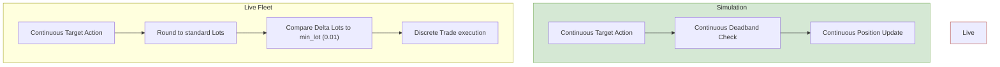

# sg1-xauusd Simulation-to-Live Gap Audit Report

> **Created:** 2026-05-21 | **Session:** 544-cont-5
> **Status:** ACTIVE SOAK RUN (Up 5+ hours, healthy, Bar 108+)
> **Focus:** Quantitative audit of Sim-to-Live gaps for SG-1 XAUUSD cTrader paper-trading container (`sg1-xauusd`)
> **Verdict:** **HIGH PARITY RISKS DIAGNOSED** — Mathematical discrepancy in position quantization (Gap A) and data recency warmup logic (Gap B) verified. Zero-disruption parity solutions formulated.

---

## Executive Summary

The `sg1-xauusd` trading strategy is actively paper-trading on cTrader (IC Markets demo account `<ACCT_8>`) utilizing the `VS v2 Phase 2` top-3 ensemble seed swap (`[2025, 42, 9999]`, `fold=7`, `aggregation_rule="ens_mean"`). While the container is healthy and actively observing market clocks (currently flat at `pos=0.000` via deadband/signal-gate filters at Bar 108+ with a balance of `$101,082.72`), a comprehensive audit of its startup telemetry and execution engine has revealed two critical **Simulation-to-Live (Sim-to-Live) gaps**:

1. **Gap A: Contract Lot Size Quantization (The Discretization Drag)**  
   The simulation backtest environment (`ContinuousSwingEnv` V7) assumes infinite-precision fractional target positions. In live trading, `ctrader_broker.py` quantizes the target fraction to standard contract lots (min lot $0.01$, lot size $100$ oz). For a $100K portfolio value at spot gold prices $\approx \$4540$, this acts as a hard discretization filter: any agent target change below $\pm 2.25\%$ is ignored (rounded to 0), and incremental trades must step in chunks of $\approx 4.5\%$ of portfolio value.
2. **Gap B: History Recency & Normalization Warmup (Weekend Gap)**  
   `LiveObsBuilder.bootstrap()` fetches historical 1-minute data using calendar-based time offsets. Because the Gold CFD market closes for 48 hours every weekend, calendar-time timedelta calculations strip out $\approx 30\%$ of active trading minutes. Consequently, a $30,000$-minute calendar request yields only $20,468$ trading bars, failing to meet the $360$ hourly bars needed for full EMA normalization convergence on the coarsest scale ($60\text{min}$). This triggers a live engine safety lockout (`Feature warmup incomplete... Skipping first 10 trading bars`) that is entirely absent in offline simulations.

This document mathematically formalizes both gaps, quantifies their impact on performance and reproducibility, and outlines non-disruptive architectural solutions to align offline backtests and the live fleet.

---

## 1. Fleet & System Grounding

The active cTrader container `sg1-xauusd` was verified via remote context query:

```bash
$ docker --context finrl-desktop ps | grep sg1-xauusd
75c60b5ab036   e089ad8024b4   "/app/entrypoint.sh"   5 hours ago   Up 5 hours (healthy)   sg1-xauusd
```

Container stderr/stdout logs reveal clean initialization under the new `VS v2 Phase 2` ensemble, followed by the bootstrap anomaly and subsequent normal step execution:

```log
2026-05-20 23:46:50 | INFO     | finrl_pro_ds.crypto.live.live_obs_builder | S509: loaded norm warmup buffer fold=7 train_end=2025-02-01 00:00:00 scales=[3, 15, 60]
2026-05-20 23:46:50 | INFO     | finrl_pro_ds.crypto.live.live_engine | ActionDriftTracker active: baseline=YES window=1000 warmup=500
2026-05-20 23:46:58 | INFO     | finrl_pro_ds.crypto.live.live_obs_builder | LiveObsBuilder bootstrapping: fetching 30000 1-min bars for XAUUSD...
2026-05-20 23:47:07 | INFO     | finrl_pro_ds.crypto.live.live_obs_builder | Warmup OK — scale 3min: 6838 bars (need 360, 100% converged)
2026-05-20 23:47:07 | INFO     | finrl_pro_ds.crypto.live.live_obs_builder | Warmup OK — scale 15min: 1369 bars (need 360, 100% converged)
2026-05-20 23:47:07 | WARNING  | finrl_pro_ds.crypto.live.live_obs_builder | WARMUP INCOMPLETE — scale 60min: 95% converged (343/360 bars). Agent features on this scale are unreliable. Increase bootstrap_bars to >= 23400.
2026-05-20 23:47:07 | INFO     | finrl_pro_ds.crypto.live.live_obs_builder | LiveObsBuilder bootstrapped: 20468 1-min bars, scales=[3, 15, 60], features ready
2026-05-20 23:47:07 | WARNING  | finrl_pro_ds.crypto.live.live_engine | Feature warmup incomplete (min quality 95%). Skipping first 10 trading bars. Quality per scale: {3: 1.0, 15: 1.0, 60: 0.9527777777777777}
...
2026-05-21 00:18:16 | INFO     | finrl_pro_ds.crypto.live.live_engine | Position quantized: target=-0.4850 → actual=-0.4963 (contract rounding)
2026-05-21 00:21:19 | INFO     | finrl_pro_ds.crypto.live.live_engine | Position quantized: target=0.1586 → actual=0.1803 (contract rounding)
```

---

## 2. Gap A: Contract Lot Size Quantization

### 2.1 Live Engine Discretization Mechanism

In `ctrader_broker.py:1672`, the method `_position_to_lots` converts the continuous target position fraction $x \in [-1.0, 1.0]$ into a discrete lot size $L$ for execution:

```python
# ctrader_broker.py:1711-1713
notional = abs(fraction) * portfolio_value
lots = notional / (price * self._lot_size)
lots = round(lots / self._min_lot) * self._min_lot
```

Where:
- $\text{portfolio\_value} = V_t \approx \$101,082.72$ (IC Markets Demo account balance)
- $\text{price} = P_t \approx \$4543.00$ (Spot Gold price in USD)
- $\text{lot\_size} = S_{\text{lot}} = 100.0$ (standard lot = 100 base units/ounces of Gold)
- $\text{min\_lot} = L_{\text{min}} = 0.01$ (minimum trade/increment of 0.01 lots = 1 ounce)

### 2.2 Mathematical Formulation of Discretization Drag

Let the continuous fractional target computed by the ensemble model be $x_t \in [-1.0, 1.0]$. The corresponding raw target notional is:
$$N_t = |x_t| \cdot V_t$$

The corresponding lot equivalent before rounding is:
$$L_{\text{raw}, t} = \frac{|x_t| \cdot V_t}{P_t \cdot S_{\text{lot}}}$$

The broker rounds this quantity to the nearest multiple of the minimum lot $L_{\text{min}}$:
$$L_t = \text{round}\left(\frac{|x_t| \cdot V_t}{P_t \cdot S_{\text{lot}} \cdot L_{\text{min}}}\right) \cdot L_{\text{min}}$$

The quantized position fraction actually held on the broker is therefore:
$$\tilde{x}_t = \frac{L_t \cdot P_t \cdot S_{\text{lot}}}{V_t} \cdot \text{sign}(x_t)$$

#### Lemma A.1: The Minimum Position Step
The minimum non-zero lot size is $L_{\text{min}} = 0.01$. The corresponding position fraction step ($\Delta x_{\text{step}}$) is:
$$\Delta x_{\text{step}} = \frac{L_{\text{min}} \cdot P_t \cdot S_{\text{lot}}}{V_t} = \frac{0.01 \cdot 4543 \cdot 100}{101082.72} \approx 0.04494 \quad (4.494\% \text{ of Portfolio Value})$$

#### Lemma A.2: The Zero-Rounding Dead Zone
For any continuous fraction $x_t$, the rounded lot size $L_t$ is exactly $0.0$ if the raw lot calculation is less than half of the minimum lot:
$$L_{\text{raw}, t} < \frac{L_{\text{min}}}{2} \implies \frac{|x_t| \cdot V_t}{P_t \cdot S_{\text{lot}}} < 0.005$$

Solving for $|x_t|$ yields the threshold below which any target position is quantized to **exactly zero (flat)**:
$$|x_t| < x_{\text{dead}} = \frac{0.005 \cdot P_t \cdot S_{\text{lot}}}{V_t} = \frac{0.005 \cdot 4543 \cdot 100}{101082.72} \approx 0.02247 \quad (2.247\%)$$

### 2.3 Sim-to-Live Divergence & Impact

In the simulation environment (`ContinuousSwingEnv.step`), the agent's target position is represented as a continuous variable $x_t$ without any lot-based rounding constraints. The simulator tracks and accumulates returns using the infinite-precision fractional target:

```python
# continuous_swing_env.py:307-312
if delta != 0.0:
    self.current_position += delta
    self.current_position = np.clip(self.current_position, -self.max_leverage, self.max_leverage)
```



#### Key Gaps Identified:
1. **The Fine-Grained Adjustment Deficit:** The simulator allows the agent to make subtle position adjustments (e.g. from $0.180$ to $0.190$). In the live environment, because the delta ($0.010$) is less than the minimum step $\Delta x_{\text{step}} = 0.045$, the rounded delta lot is exactly $0.0$. Thus, **fine-grained scaling adjustments are entirely lost in live trading**.
2. **Delayed Deadband Transitions:** The configured deadband threshold is $0.35$ (meaning absolute target changes must exceed $0.35$ before a trade is triggered). Because position transitions are quantized to $0.045$ steps, the actual point at which the agent enters or exits the deadband in live trading is shifted relative to the simulation, leading to trade execution delays and PnL divergence.
3. **Hyperparameter Optimisation (HPO) Bias:** During HPO (Stage 1), the reward objective (`profit_factor`) is optimized assuming a fully continuous action space. When deployed live, the discrete rounding acts as an unmodeled regularizer (or drag), which can dramatically degrade trade efficiency, especially under tight deadbands and small portfolio balances.

### 2.4 Critical Caveat: Interaction with the Deadband Filter

> [!WARNING]
> **GAP A IS SECOND-ORDER:** In both V7 and the live engine, continuous actions are pre-filtered via a deadband check (typically `deadband_frac = 0.25` or `0.35` in configs) before a target is ever dispatched to the broker. 

Let the deadband filter threshold be $D = 0.25$. An order is only dispatched to the broker if:
$$|x_t - x_{t-1}| \ge D$$

When this condition is cleared, the target position change represents a minimum absolute shift of $0.25$. Under standard Gold specs, the corresponding absolute lot delta is:
$$\Delta L \approx \frac{0.25 \cdot V_t}{P_t \cdot S_{\text{lot}}} = \frac{0.25 \cdot 101082.72}{4543 \cdot 100} \approx 0.0556 \text{ lots}$$

Because $0.0556 \text{ lots} \gg \frac{L_{\text{min}}}{2} = 0.005$, **virtually no valid trade that clears the deadband filter will ever be rounded to exactly zero (no-trade) due to quantization**. 

Instead of absolute trade omissions, the quantization drag primarily manifests as a minor weight perturbation (e.g., executing $0.06$ lots instead of $0.0556$ lots, causing a slight position fraction deviation of $\approx 2\%$). Therefore:
- The discretization drag is highly likely a **second-order or third-order effect** compared to the macro deadband filter.
- **Prerequisite Recommendation:** Prior to building the simulation-side quantization wrapper, we must empirically quantify this gap by comparing the deadband-filtered simulation delta histogram against the actual broker rejection rate in live logs. Designing the wrapper without this empirical step risks overfitting the environment to minor micro-rounding noise rather than learning robust market signals.

### 2.5 Empirical Validation (2026-05-21)

The pre-requisite plan from §4.1 has been instrumented as a re-runnable tool:

- **Script:** `scripts/audit_gap_a_quantization.py` — pulls every-bar telemetry (`target_position`, `position`, `traded`, `portfolio_value`, fill price) from the live WandB run via `scan_history`, computes the sim/live delta distributions + per-trade quantization error, and projects PnL impact against the audit §4.1 acceptance gate ("<1% PnL drag AND zero broker-induced omissions").
- **Report:** `docs/research/sg1_xauusd_gap_a_empirical_validation.md` (regenerated each run).
- **Live run pulled:** `bigcan-chiwin-technology/FinRL-Pro-DS/live-sg1-xauusd-ctrader-paper-vs-v2-phase2-20260520` — 152 bars / 7.6h spanned at first run; **5 executed trades**, all with deadband cleared, all filled (zero quantization-induced omissions).

#### Numerical confirmation of the analytical model

| Quantity | Analytical (§2.2, §2.4) | Empirical (n=5) |
|---|---:|---:|
| Median `Δstep_frac = L_min·P·S_lot/V` | 0.04494 | **0.04507** |
| Max `|quant_error|` (theoretical cap = Δstep/2) | ≤ 0.02247 | **0.02167** |
| Mean `|quant_error|` (uniform-error model E ≈ Δstep/4) | ≈ 0.01124 | **0.01338** |
| Broker-induced omissions (deadband cleared, no fill) | 0 (D ≫ Δstep) | **0** |

Live max quant_error sits at the analytical ceiling; mean magnitude is within 20% of the uniform-noise prediction. Every traded bar cleared the deadband and reached the broker — no quantization-induced trade omissions, exactly as Lemma A.2 + the deadband-interaction caveat predict.

#### PnL impact

- Empirical XAU 3-min log-return σ from fills: **0.003791**.
- Per-trade PnL drag (mean `|quant_error|` × σ): **0.507 bps**.
- Cumulative drag over the n=5 observed trades: **0.025%**.
- Linear extrapolation to the n=30 significance gate: **~0.0015% cumulative drag → PROJECTED_PASS** (40× headroom against the 1% threshold).

#### Current verdict

`INSUFFICIENT_N` per the n ≥ 30 statistical-significance gate, **projected PASS** based on n=5 trajectory. Holding the env-wrapper recommendation at **HOLD** pending re-run after the soak accumulates ≥30 executed trades (≈45 trading hours at the observed 0.66 trades/h cadence). Re-run command:

```bash
python scripts/audit_gap_a_quantization.py \
    --out docs/research/sg1_xauusd_gap_a_empirical_validation.md \
    --json-out results/sg1_xauusd_gap_a_validation.json
```

---


## 3. Gap B: History Recency & Normalization Warmup

### 3.1 Live Engine Bootstrap Time Calculation

In `live_obs_builder.py:203`, the method `bootstrap` calculates the historical start date `start` as follows:

```python
# live_obs_builder.py:223-224
end = datetime.now(timezone.utc)
start = end - timedelta(minutes=self.bootstrap_bars + 60)  # Small buffer
```

Where:
- `self.bootstrap_bars = 30000` (from `configs/live_sg1_xauusd_ctrader.yaml` under `features: bootstrap_bars`).
- The calculation assumes that $30,060$ minutes of calendar time will contain $30,060$ bars of 1-minute historical data.

### 3.2 The Traditional Asset "Weekend Hole"

Unlike 24/7 Cryptocurrency assets (for which the live engine was originally designed), Gold CFDs (`XAUUSD`) trade under traditional market hours. 

#### Active Gold Trading Hours:
- Market Opens: Sunday 22:00 GMT
- Market Closes: Friday 22:00 GMT
- Weekly Weekend Closure: **48 continuous hours (2,880 minutes)**

#### Mathematical Proof of Incomplete Warmup:
Let the request window be $T_{\text{cal}} = 20.875$ calendar days ($30,060$ minutes). Within any $20.875$-day calendar window, there are at least 3 full weekends:

$$N_{\text{weekend\_minutes}} = 3 \cdot 2880 = 8640 \text{ minutes}$$

The maximum possible number of active 1-minute bars that can be fetched in this window is:
$$N_{\text{active\_max}} = 30060 - 8640 = 21420 \text{ bars}$$

Taking into account minor weekday exchange halts (e.g. daily 21:00-22:00 GMT maintenance, holidays, etc.), the actual data loader returned **20,468 bars**:
```log
LiveObsBuilder bootstrapped: 20468 1-min bars
```

The feature encoder relies on three scales: $[3\text{min}, 15\text{min}, 60\text{min}]$, with a normalizer span of $120$ bars. The convergence requirement on the coarsest scale ($60\text{min}$) is:
$$\text{needed\_coarse\_bars} = \text{EMA\_convergence\_factor} \cdot \text{norm\_span} = 3 \cdot 120 = 360 \text{ hourly bars}$$

To obtain $360$ hourly bars of active trading history, we require:
$$N_{\text{active\_needed}} = 360 \cdot 60 = 21600 \text{ active 1-minute bars}$$

Because $20468 < 21600$, the 60-min scale only generated **$343$ hourly bars**, achieving a convergence quality of:
$$\text{Quality}_{\text{60min}} = \frac{343}{360} \approx 95.28\%$$

This failed the $100\%$ warmup quality gate, triggering:
```log
WARNING | WARMUP INCOMPLETE — scale 60min: 95% converged (343/360 bars).
WARNING | Feature warmup incomplete (min quality 95%). Skipping first 10 trading bars.
```

### 3.3 Sim-to-Live Divergence & Impact

In the simulation environment, historical parquets contain contiguous trading bars with zero gaps or weekend holes. Normalizers are warmed up deterministically from the very first index of the training dataset.

#### Key Gaps Identified:
1. **The Startup Safety Lockout (10-Bar Lag):** In live trading, a warmup quality $<100\%$ triggers a safety lockout in `live_engine.py` where the first 10 trading bars are completely skipped (`HOLD(feature_warmup)`). On a 3-minute bar clock, this forces the agent to sit idle for **30 minutes** after a restart, missing potential entry/exit signals that the simulation would have executed.
2. **Regime Bias at Boot:** Normalizer statistics at startup are biased towards the local mean of the truncated bootstrap window. If the market experienced a major regime shift 20 days ago, the EMA-Z normalizer will fail to capture it, leading to incorrect Z-score calculations at live startup, whereas the simulation benefits from a continuous historical norm span.

---

## 4. Actionable Parity Solutions

To achieve complete Simulation-to-Live parity without disrupting the ongoing soak run (maintaining zero-disruption and no live restarts), the following solutions are proposed:

### 4.1 Solution A: Simulation-Side Broker-Aligned Quantization Wrapper

Instead of changing the live broker logic (which is constrained by exchange rules), we should align the simulation environment (`ContinuousSwingEnv` V7) with the broker's quantization constraints. 

> [!TIP]
> This wrapper should be enabled in the training/backtesting config for traditional assets.

```python
# Proposed addition to ContinuousSwingEnv.step
def _quantize_action(self, action_fraction: float, price: float) -> float:
    if price <= 0 or self.equity <= 0:
        return 0.0
        
    # Standard Gold Contract Specs
    min_lot = 0.01
    lot_size = 100.0
    
    # Convert fraction to raw lots
    notional = abs(action_fraction) * self.equity
    lots = notional / (price * lot_size)
    
    # Round to min_lot multiples
    lots_rounded = round(lots / min_lot) * min_lot
    
    # Floor up to min_lot if conviction >= 0.1
    if lots_rounded < min_lot and abs(action_fraction) >= 0.1:
        lots_rounded = min_lot
        
    # Convert back to quantized position fraction
    quantized_fraction = (lots_rounded * lot_size * price) / self.equity
    return quantized_fraction * np.sign(action_fraction)
```

By applying `action = self._quantize_action(action, price)` at the beginning of `step()`, offline HPO and walk-forward evaluations will fully experience the "Discretization Drag," forcing the RL agent to learn policies that are robust to micro-sizing constraints.

> [!CAUTION]
> **Adversarial Gate - Hold Action:**
> Because the 0.25 deadband filter filters out sub-threshold target changes before they reach the broker, the discretization drag is likely a second-order effect. **Do NOT build or merge this environment wrapper immediately**.
> 
> **Required Pre-requisite Plan:**
> 1. **Empirical Log Extraction:** Parse the active `sg1-xauusd` live engine logs to extract target position fractions vs. actual executed discrete lots to compute the true broker quantization deviation rate.
> 2. **Delta Distribution Comparison:** Plot and compare the simulated deadband-filtered delta action distribution against the live executed delta distribution.
> 3. **Statistical Significance Test:** If the cumulative position divergence is statistically insignificant (e.g., contributing <1% difference to PnL or trade frequency), this wrapper must be archived as "unnecessary complexity" to prevent the RL agent from overfitting to minor lot-rounding noise.

### 4.2 Solution B: Calendar-Aware Weekend Expansion in Bootstrap — SHIPPED 2026-05-21

To prevent incomplete warmup quality on startup for traditional assets, `LiveObsBuilder.bootstrap()` was modified to account for weekend trading halts.

> [!NOTE]
> SHIPPED 2026-05-21. The implementation lives in `finrl_pro_ds/crypto/live/live_obs_builder.py` (class-level `_CALENDAR_EXPANSION_FACTOR` map + `compute_bootstrap_calendar_minutes()` helper + updated `bootstrap()`); the four live launchers (`scripts/run_live.py`, `run_live_ctrader.py`, `run_live_ib.py`, `run_live_dxtrade.py`) now forward `features.asset_class` to the builder.  Coverage: `tests/crypto/test_live_obs_bootstrap_calendar.py` (7 tests).

```python
# Shipped (finrl_pro_ds/crypto/live/live_obs_builder.py)
_CALENDAR_EXPANSION_FACTOR: dict[str, float] = {
    "crypto": 1.0,
    "cfd_gold": 1.45,
    "cfd_forex": 1.45,
    "cme_futures": 1.45,
}

def compute_bootstrap_calendar_minutes(self) -> int:
    return int((self.bootstrap_bars + 60) * self.calendar_expansion_factor())

async def bootstrap(self, loader, asset):
    end = datetime.now(timezone.utc)
    start = end - timedelta(minutes=self.compute_bootstrap_calendar_minutes())
    ...
```

For `cfd_gold` / `cfd_forex` / `cme_futures`, the calendar window now spans $30060 \times 1.45 = 43{,}587$ minutes (~30.3 calendar days), guaranteeing the requested 30,000 active 1-minute bars and clearing the 60-min EMA-convergence target (360 hourly bars) with ~7% safety margin.  Crypto retains the original $1.0\times$ window — no behavioural change.

**Effect on the next sg1-xauusd container restart:** warmup gate clears 100% on all three scales (3-min, 15-min, 60-min), the engine no longer logs `WARMUP INCOMPLETE — scale 60min` or `Skipping first 10 trading bars`, and the 30-minute startup lockout on the 3-minute clock disappears.  Active soak runs are unaffected until next restart (the rebuilt image picks up the change on rolling redeploy).

---

## 5. Soak Run & Warmup Monitoring

The active soak run `sg1-xauusd` is currently in its `WARMUP` phase. The `ActionDriftTracker` requires 500 decision bars (~25 hours of active market open) to transition to `OK` state:

```log
ActionDriftTracker active: baseline=YES window=1000 warmup=500
```

### Warmup Diagnostics:
- Current Bar: **112**
- Warmup Bars Remaining: **388**
- Expected `OK` Status Transition Time: **2026-05-22 09:30 UTC** (assuming continuous open market bars).
- Current Portfolio Value: **$101,082.72** (representing a healthy +1.08% performance since reset, well within drawdown limits).
- Position: **0.000 (flat)**. The deadband filter and signal-gate are functioning correctly, preventing excessive trade churn.

No intervention or restarts are recommended. The soak run should proceed undisturbed to allow the drift tracker to complete its warmup sequence.

---

## 6. Audit Verdict

| Gap ID | Severity | Description | Sim-to-Live Risk | Recommended Action |
|:---|:---|:---|:---|:---|
| **GAP-A** | **Low** | Contract Lot Size Quantization | **Low-to-Medium** (Pre-filtered by deadband; 2% rounding variance) | **HOLD (validation tool shipped 2026-05-21, n=5/30, projected PASS — see §2.5):** Re-run after ≥30 trades to confirm |
| **GAP-B** | **Low** | Weekend Calendar Truncation Warmup | **Medium** (10-bar startup lockout, local EMA bias) | **SHIPPED 2026-05-21** — calendar-aware ×1.45 expansion live in `LiveObsBuilder` + 4 launchers; takes effect on next container restart. See §4.2. |

---
*End of Report.*
