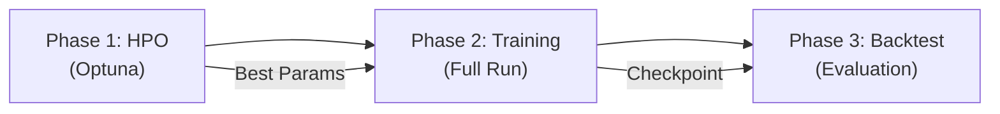

# FinRL-Pro DeepScalper — Architecture & Pipeline Blueprint

## Goal Description
Replicate the **DeepScalper** framework (Deep Reinforcement Learning for Intraday Trading) as described in *Sun et al. (2022)*, integrated into the `FinRL-Pro_DS` ecosystem. This blueprint is the single source of truth for system architecture, pipeline specification, and all upgrades beyond the original paper.

---

## Plan vs. Paper: Fidelity & Upgrades

| Feature | DeepScalper Paper (Sun et al.) | FinRL-Pro Implementation | Status |
| :--- | :--- | :--- | :--- |
| **Core Architecture** | Micro(LOB)+Macro(Tech) Fusion | Micro(LOB)+Macro(Tech) Fusion | 🟢 **Aligned** |
| **Action Space** | Discrete Branching (Price/Vol) | Discrete Branching (**Dir**/Price/Vol) — 3 branches | 🟡 **Extended** |
| **Primary Algorithm** | Dueling DQN | Branching Dueling DQN (BDQ) | 🟢 **Aligned** |
| **Agent Strategy** | Single Agent | **Single BDQ Agent** | 🟢 **Aligned** |
| **Experience Replay** | PER (Section 4.3) | **PER** (SumTree, IS weights, β-annealing) | 🟢 **Aligned** |
| **Hybrid Loss** | $L_q + ρ × L_{vol}$ | $L_q + ρ × L_{vol}$ with IS-weighted TD error | 🟢 **Aligned** |
| **Hindsight Bonus** | $r_{hind}$ (train-only) | $r_{hind}$ (train-only, configurable $w$, $h$) | 🟢 **Aligned** |
| **Reward: Risk-Aware** | Volatility prediction only | **+ Differential Sharpe Ratio (DSR)** (opt-in) | 🚀 **Upgraded** |
| **Macro Features** | Table 2 (OHLCV + SMA ratios) | Table 2 aligned (11 features, basis-point normalized) | 🟢 **Aligned** |
| **Micro Features** | LOB L5 + OFI + Spread + Ret | LOB L5 + OFI(5) + Spread + Ret (27 dims) | 🟢 **Aligned** |
| **Private State** | Position + Balance | Position + Balance (normalized, augmented in training) | 🟢 **Aligned** |
| **Weight Init** | Not specified | **Orthogonal (RNN) + Xavier (Linear)** | 🚀 **Upgraded** |
| **HPO** | Bayesian / Grid | **Optuna (TPE + Hyperband pruning)** | 🚀 **Upgraded** |
| **Data Storage** | Flat Files (Implied) | **Parquet + Shared Memory (SHM)** | 🚀 **Upgraded** |
| **Evaluation** | Custom Backtester | **Pyfolio** (Institutional Grade) + standalone HTML | 🚀 **Upgraded** |
| **Monitoring** | Static Plots | **WandB** (Real-time Tracking) | 🚀 **Upgraded** |
| **Framework** | Plain PyTorch/Gym | **Gymnasium** + FinRL-Pro Ecosystem | 🚀 **Upgraded** |
| **Deployment** | Manual | **Automated** (SCP → Miniconda → nohup) | 🚀 **Upgraded** |
| **Autonomous Ops** | N/A | **Ralph Driver** (Deploy→Monitor→Fix→Retry) | 🚀 **Upgraded** |
| **Data Splitting** | Fixed train/test | **Rolling Window Splitter** (Walk-Forward) | 🚀 **Upgraded** |
| **Execution Model** | N/A | **Margin checks + Slippage model** | 🚀 **Upgraded** |
| **Asset Universe** | CSI 300 / Various | **Bitcoin Perpetual Futures** (BTC-USDT) | **Defined** |

---

## User Review Required
> [!IMPORTANT]
> **Asset Scope**: Training and testing **exclusively on Bitcoin Perpetual Futures**.
> - **Symbol**: `BTCUSDT` (Perpetual Contract)
> - **Exchange**: Binance Futures (Simulated via Kaggle Data)

> [!IMPORTANT]
> **Tooling Mandate**:
> - **Evaluation**: `pyfolio` (via `empyrical`) for performance metrics; standalone HTML fallback.
> - **Monitoring**: `wandb` (Weights & Biases) for experiment tracking.
> - **Deployment**: `deploy_bare_metal.py` → GPUHub via SCP+SSH.
> - **Hardware**: Optimized for **NVIDIA RTX 5090 (Blackwell)** (TF32, AMP, 12–24 Envs).
> - **Data Source (Training)**: **CoinAPI** LOB data (Synthetic OHLCV, Parquet, `fastparquet`).
> - **Security**: API Credentials loaded from `.env` (git-ignored).

## Non-Goals
- **Ensemble Methods**: Strictly Single BDQ. Multi-agent ensembles are out of scope.
- **Legacy Formats**: No CSV/Pandas for core training; Parquet/NumPy mandatory.
- **Live Trading**: V1 is simulation-only; Binance API stubs reserved for V2.

---

## 1. Network Architecture Specification

### 1.1 MicroEncoder (LSTM)
**File**: [`networks.py`](file:///c:/FinRL/FinRL-Pro_DS/finrl_pro_ds/agents/deepscalper/networks.py)

Encodes LOB snapshots (micro-structure) and trader private state.

| Parameter | Value | Notes |
|:---|:---|:---|
| `input_size` | 27 | 20 (LOB L5×4) + 5 (OFI) + 1 (Spread) + 1 (Return) |
| `private_input_size` | 2 | Normalized position ∈ [-1,1], balance ∈ [0,2] |
| `hidden_size` | 256 | Production config |
| `num_layers` | 1 | Single-layer LSTM |
| `rnn_type` | LSTM | Configurable (LSTM/GRU) |
| `dropout` | 0.0 | Disabled for single-layer |

**Forward pass**: LOB sequence `(B, W, 27)` → LSTM → last hidden `(B, 256)` → concat with private MLP output `(B, 32)` → final projection `(B, 256)`.

**Weight Init**: Orthogonal initialization for RNN weights, Xavier for linear layers.

### 1.2 MacroEncoder (MLP)
Encodes OHLCV technical indicators (Table 2 from paper).

| Parameter | Value | Notes |
|:---|:---|:---|
| `input_size` | 11 | 5 (OHLCV z-scores) + 6 (SMA deviation ratios) |
| `hidden_sizes` | [256, 128] | Two-layer MLP with ReLU + optional dropout |

**Features (11 total)**: `z_open, z_high, z_low, z_close, z_volume, zd_5, zd_10, zd_15, zd_20, zd_25, zd_30` — all in basis points, clamped to [-100, 100].

### 1.3 DeepScalperNetwork (Fusion + Heads)
Combines Micro and Macro embeddings into a fused representation and produces branching Q-values.

```
MicroEncoder(B,W,27) + Private(B,2) ──→ (B, 256)
                                            ├──→ FusionLayer ──→ (B, 256)
MacroEncoder(B, 11) ─────────────────→ (B, 128) ─┘       │
                                                          ├─→ V(s): State Value Head     → (B, 1)
                                                          ├─→ Q_dir: Direction Advantage → (B, 3)
                                                          ├─→ Q_price: Price Advantage   → (B, 5)
                                                          ├─→ Q_vol: Volume Advantage    → (B, 5)
                                                          └─→ AuxHead: Volatility Pred   → (B, 1)
```

**Action Space** (3 branches, 75 combinations):

| Branch | Bins | Semantics |
|:---|:---|:---|
| Direction | 3 | Hold / Buy / Sell |
| Price | 5 | Discrete price offsets from mid |
| Volume | 5 | Discrete quantity proportions of `max_position` |

**Dueling Mechanism**: $Q(s,a) = V(s) + Adv(s,a) - \text{mean}(Adv)$ applied independently per branch.

---

## 2. Agent Specification (BDQ)
**File**: [`bdq_agent.py`](file:///c:/FinRL/FinRL-Pro_DS/finrl_pro_ds/agents/deepscalper/bdq_agent.py)

### 2.1 Core Algorithm
| Parameter | Production Value | Paper Reference |
|:---|:---|:---|
| Learning Rate | 1e-4 | 1e-4 (fixed) |
| Gamma | 0.995 | 0.99–0.995 |
| Batch Size | 1024 | 128–256 (upgraded for RTX 5090) |
| Buffer Size | 2M | 1–2M |
| Target Update Freq | 7500 steps | 5K–15K |
| Learning Starts | 5000 | 2K–5K |
| Update Interval | 2.0 steps | Fractional via accumulator |
| Epsilon Start/End | 1.0 → 0.01 | ε-greedy |
| Epsilon Decay | 0.999908 | Calibrated for 1M steps @ num_envs=20 |
| Auxiliary Weight (ρ) | 1.0 | Paper optimal |

### 2.2 Hybrid Loss Function
$$L = \underbrace{w_i \cdot (Q_{pred} - y_{TD})^2}_{L_q \text{ (IS-weighted)}} + \rho \times \underbrace{(V_{pred} - \sigma_{actual})^2}_{L_{vol}}$$

- **$L_q$**: TD error, weighted by IS weights from PER.
- **$L_{vol}$**: Volatility prediction MSE (auxiliary supervised task).
- **TD Target**: $y = r + \gamma \cdot Q_{target}(s', \arg\max_{a'} Q_{online}(s', a'))$ (Double DQN).

### 2.3 Prioritized Experience Replay (PER)
**File**: [`per_buffer.py`](file:///c:/FinRL/FinRL-Pro_DS/finrl_pro_ds/agents/deepscalper/per_buffer.py)

| Parameter | Value | Reference |
|:---|:---|:---|
| α (priority exponent) | 0.6 | Schaul et al. (2016) |
| β_start | 0.4 | IS correction start |
| β_frames | 100K | Anneal β → 1.0 |
| ε (priority floor) | 1e-6 | Prevents zero-priority |

**Implementation**: `SumTree` (flat array) for O(log N) proportional sampling with stratified segments. Priority update formula: $p_i = (|\delta_i| + \epsilon)^\alpha$. Max-priority decay: `_max_priority *= 0.999` per update to prevent permanent bias from early high-error samples.

### 2.4 Exploration Strategy
Multiplicative epsilon decay: `ε *= decay` called once per `num_envs` steps (not per individual env step). Reaches `epsilon_end=0.01` at ~1M total timesteps with `num_envs=20`.

---

## 3. Environment Specification
**File**: [`deep_scalper_env.py`](file:///c:/FinRL/FinRL-Pro_DS/finrl_pro_ds/envs/deep_scalper_env.py)

### 3.1 Observation Space (Dict)
```python
{
    "micro":   Box(shape=(window_size, 27), dtype=float32),  # LOB sequence
    "macro":   Box(shape=(11,),            dtype=float32),  # Technical indicators
    "private": Box(shape=(2,),             dtype=float32),  # [norm_position, norm_balance]
}
```

### 3.2 Reward Function
Paper-aligned reward with optional DSR extension:

$$r_t = \underbrace{(p_{t+1} - p_t) \times pos_t - fees}_{r_{PnL}} + \underbrace{w \times pos_t \times (p_{t+h} - p_t)}_{r_{hind}} + \underbrace{\lambda_{sharpe} \times DSR_t}_{r_{DSR} \text{ (opt-in)}}$$

| Component | Config Key | Default | Notes |
|:---|:---|:---|:---|
| Reward Scaling | `reward.scaling` | 1.0 | Paper: no scaling |
| Hindsight Weight ($w$) | `reward.hindsight_weight` | 0.1 | Paper optimal |
| Hindsight Horizon ($h$) | `reward.hindsight_horizon` | 180 min | Paper optimal |
| Volatility Horizon | `reward.volatility_horizon` | 100 | For $L_{vol}$ auxiliary target |
| Sharpe Weight ($\lambda$) | `reward.sharpe_weight` | 0.0 | DSR disabled by default |
| Sharpe Horizon | `reward.sharpe_horizon` | 100 | EMA lookback for DSR |

**Hindsight Bonus**: Applied only during **training**. Backtest uses realized PnL only.

### 3.3 Fee Structure
| Parameter | Production | Notes |
|:---|:---|:---|
| Maker Fee | 2 bps | Binance VIP1 |
| Taker Fee | 4 bps | Binance VIP1 |
| Margin Requirement | 1.0 (Spot) | 0.5 = 2× leverage |

**Margin Check**: Orders rejected if insufficient balance to cover initial margin. Symmetric margin logic prevents asymmetric position bias.

### 3.4 Slippage Model
Market-impact slippage: `slippage = base + (trade_size / liquidity) × impact_factor`. Applied to execution price for realistic simulation.

### 3.5 Episode Termination
- End of data window
- Max drawdown exceeded (`max_drawdown_pct`, default 30%)

### 3.6 Private State Augmentation
During `reset()`, the trader's initial private state (position, balance) may be randomly augmented to improve data efficiency and prevent overfitting (per paper Section 4.2).

---

## 4. Data Pipeline Specification

### 4.1 Feature Engineering
**File**: [`feature_engineering.py`](file:///c:/FinRL/FinRL-Pro_DS/finrl_pro_ds/data/feature_engineering.py)

**Micro Features (27 dims per timestep)**:
1. **LOB Prices/Volumes** (20): L5 bid/ask prices & volumes — normalized as basis-point deviation from mid-price; volumes log-normalized + z-scored, clamped to [-5, 5].
2. **Order Flow Imbalance (OFI)** (5): Per-level `(bid_vol - ask_vol) / (bid_vol + ask_vol)`.
3. **Spread** (1): `(best_ask - best_bid) / mid_price × 10000` (basis points).
4. **Mid-Price Return** (1): Log return of mid-price.

**Macro Features (11 dims)**:
- OHLCV z-scores (5) + SMA deviation ratios at k={5,10,15,20,25,30} (6).
- All in basis points, clamped to [-100, 100].
- Aligned to micro timestamps via `searchsorted` (O(N log M)).

### 4.2 Parquet Data Handler
**File**: [`parquet_handler.py`](file:///c:/FinRL/FinRL-Pro_DS/finrl_pro_ds/data/parquet_handler.py)

Streaming data access with zero-copy shared memory support:

| Feature | Description |
|:---|:---|
| **Storage** | Parquet via `fastparquet` (columnar, compressed) |
| **Shared Memory** | Optional SHM blocks for multi-env zero-copy access |
| **Streaming API** | `reset() → step() → peek()` pointer-based access |
| **Lookahead** | `get_lookahead_price(h)` for hindsight bonus |
| **Aux Targets** | `get_lookahead_volatility(h)` — pre-computed, O(1) lookup |
| **Date Filtering** | `start_date / end_date` for train/val/test splits |

### 4.3 Rolling Window Splitter
**File**: [`splitter.py`](file:///c:/FinRL/FinRL-Pro_DS/finrl_pro_ds/data/splitter.py)

Non-stationary walk-forward cross-validation:
```
Fold 1: [Train 3mo] → [Val 1mo] → [Test 1mo]
Fold 2:     [Train 3mo] → [Val 1mo] → [Test 1mo]  (shifted by step_months)
...
```
Configurable: `train_months`, `val_months`, `test_months`, `step_months`, `buffer_days`.

---

## 5. Training Pipeline Specification
**File**: [`run_full_pipeline.py`](file:///c:/FinRL/FinRL-Pro_DS/scripts/run_full_pipeline.py) (788 lines)

### 5.1 Three-Phase Architecture



### Phase 1 — Hyperparameter Optimization
**Engine**: Optuna with TPE sampler + `MedianPruner` for early stopping.

| Parameter | Production | Notes |
|:---|:---|:---|
| Trials | 50 | Full search |
| Steps/Trial | 50K | 5% of total for robust signal |
| Objective | Sharpe Ratio | Evaluated via `evaluate_for_hpo()` |
| Vectorization | `SyncVectorEnv` | Avoids IPC/FD crashes on containers |

**Search Space**:

| Hyperparameter | Range | Type | Notes |
|:---|:---|:---|:---|
| Hindsight Horizon ($h$) | [30, 60, 90, 120, 150, 180] | Categorical | Paper: 180 min optimal |
| Hindsight Weight ($w$) | [0.05, 0.2] | Log-Uniform | Paper optimal: 0.1 |
| Aux. Task Weight ($\rho$) | [0.5, 1.5] | Log-Uniform | Paper optimal: 1.0 |
| Learning Rate | [5e-5, 5e-4] | Log-Uniform | |
| Target Update Freq | [5000, 7500, 10000, 15000] | Categorical | |
| Batch Size | [256, 512] | Categorical | |
| Gamma | [0.99, 0.995] | Categorical | |
| Epsilon End | [0.01, 0.10] | Uniform | |

> [!IMPORTANT]
> **`reward_scaling` is NOT tuned via HPO** — fixed at `1.0` (paper default). Tuning it previously allowed HPO to crush the reward signal to 0.286×, causing negative Sharpe.

### Phase 2 — Full Training
**Trainer**: [`deepscalper_trainer.py`](file:///c:/FinRL/FinRL-Pro_DS/finrl_pro_ds/training/deepscalper_trainer.py)

| Parameter | Production | Notes |
|:---|:---|:---|
| Total Timesteps | 1M (Phase 1, scales to 10M) | Configurable |
| Vectorized Envs | 12 (Production) / 4 (Dev) | `AsyncVectorEnv` (spawn context) |
| torch.compile | ✅ Enabled | Graph-mode optimization |
| AMP (FP16) | ✅ Enabled | RTX 5090 Tensor Cores |
| TF32 | ✅ Enabled | Blackwell matmul precision |
| Gradient Accumulator | Fractional step support | Handles `update_interval=2.0` correctly |
| Checkpointing | Every 100K steps | `checkpoints/{run_name}/` |
| WandB Logging | Loss, rewards, epsilon, SPS | Per `log_interval` |

### Phase 3 — Backtesting
- Loads best checkpoint from Phase 2.
- Runs deterministic (`ε=0`) evaluation on held-out test window.
- Generates portfolio value curve, trade log, and pyfolio tear sheets.
- All metrics logged to WandB (summary + artifacts).

---

## 6. Deployment & Operations

### 6.1 Canonical Naming
**File**: [`naming.py`](file:///c:/FinRL/FinRL-Pro_DS/finrl_pro_ds/utils/naming.py)

Format: `DeepScalper_V{version}_{Platform}_{YYYYMMDD}_{HHMM}`
- **No Suffixes**: Metadata (Pilot, HPO) → WandB **Tags** only.
- **Runtime Validation**: `validate_run_name()` raises `ValueError` on violations.

### 6.2 Deployment Script
**File**: [`deploy_bare_metal.py`](file:///c:/FinRL/FinRL-Pro_DS/scripts/deploy_bare_metal.py)

Automated 4-step deployment via SSH/SCP:

| Step | Action | Details |
|:---|:---|:---|
| 1. **Pack** | `create_filtered_zip()` | Excludes `data/`, `wandb/`, `.venv/`, `hpo.db` |
| 2. **Upload** | SCP zip + data | Gold Cache verification on remote |
| 3. **Setup** | Miniconda + deps | PyTorch 2.5+, CUDA 12.x |
| 4. **Launch** | `nohup` + PID tracking | `run_full_pipeline.py` or custom script |

**CLI Flags**: `--script`, `--platform`, `--version`, `--config`, `--extra-args`, `--fresh_hpo`, `--no-kill`.

### 6.3 Ralph Autonomous Driver
**File**: [`ralph_autonomous.py`](file:///c:/FinRL/FinRL-Pro_DS/scripts/ralph_autonomous.py)

Self-correcting operations loop:

```
Deploy → Monitor (poll 60s) → Verify → Diagnose → Fix → Retry
```

| Feature | Detail |
|:---|:---|
| State Persistence | `.agent/ralph_state.json` |
| Max Wait | 8 hours per run |
| Log Interval | WandB/status updates every 15 min |
| WandB Check | Verifies physical process AND WandB run are alive |
| Auto-Diagnosis | Analyzes failure logs and applies known fixes |

### 6.4 Analytics & Reporting
| Tool | File | Purpose |
|:---|:---|:---|
| **WandB Evaluator** | [`wandb_evaluator.py`](file:///c:/FinRL/FinRL-Pro_DS/finrl_pro_ds/analytics/wandb_evaluator.py) | Metrics, benchmark comparison, trade log, WandB artifact upload |
| **Pyfolio Analyzer** | [`pyfolio_analyzer.py`](file:///c:/FinRL/FinRL-Pro_DS/finrl_pro_ds/analytics/pyfolio_analyzer.py) | Institutional tear sheets (returns, drawdown, rolling Sharpe) |
| **Report Generator** | [`generate_report.py`](file:///c:/FinRL/FinRL-Pro_DS/scripts/generate_report.py) | Standalone HTML performance reports |
| **WandB Fetch** | [`fetch_wandb_run.py`](file:///c:/FinRL/FinRL-Pro_DS/scripts/fetch_wandb_run.py) | Pull run data from WandB API for offline analysis |

---

## 7. Configuration System

Two YAML configs with deep-merge support:

| Config | Purpose | Key Differences |
|:---|:---|:---|
| [`deepscalper_rtx5090_production.yaml`](file:///c:/FinRL/FinRL-Pro_DS/configs/deepscalper_rtx5090_production.yaml) | RTX 5090 Production | 12 envs, 1M steps, 50 HPO trials |
| [`deepscalper_dev.yaml`](file:///c:/FinRL/FinRL-Pro_DS/configs/deepscalper_dev.yaml) | Local Dev/Test | 4 envs, 50K steps, 5 HPO trials |

**Config Sections**: `data`, `features`, `env` (reward, action), `network` (micro_config, macro_config), `agents.bdq`, `training`, `hpo`, `wandb`.

---

## 8. Test Suite

| Test File | Coverage |
|:---|:---|
| `tests/deepscalper/` | Unit tests for network forward pass, agent predict/train, PER buffer |
| `tests/test_env_loading.py` | Environment instantiation, obs space validation |
| `tests/test_audit_fixes.py` | Regression tests for 7 robustness fixes |
| `tests/test_audit_regression.py` | Comprehensive regression (18K lines) — reward, PER, margin, epsilon |
| `tests/test_trainer_hpo.py` | Trainer init, HPO wiring, checkpoint save/load |

---

## 9. Codebase Module Map

```
finrl_pro_ds/
├── agents/deepscalper/
│   ├── networks.py          # MicroEncoder, MacroEncoder, DeepScalperNetwork
│   ├── bdq_agent.py         # DeepScalperBDQ agent (predict, train_step, PER integration)
│   └── per_buffer.py        # SumTree + PrioritizedReplayBuffer
├── envs/
│   └── deep_scalper_env.py  # DeepScalperEnv (Gymnasium, Dict obs, reward, margin, slippage)
├── training/
│   ├── deepscalper_trainer.py  # Training loop, WandB logging, AMP, optuna integration
│   └── accumulators.py         # GradientAccumulator for fractional update intervals
├── data/
│   ├── feature_engineering.py  # Micro (LOB) + Macro (OHLCV) feature extraction
│   ├── parquet_handler.py      # Streaming Parquet reader with SHM support
│   ├── splitter.py             # RollingWindowSplitter (walk-forward)
│   └── binance_loader/        # Binance API data fetching (V2 placeholder)
├── analytics/
│   ├── wandb_evaluator.py     # WandB metrics + benchmark comparison
│   └── pyfolio_analyzer.py    # Institutional performance tear sheets
└── utils/
    └── naming.py              # Canonical run name generation + validation

scripts/
├── run_full_pipeline.py       # 3-phase pipeline (HPO → Train → Backtest)
├── deploy_bare_metal.py       # Automated SSH/SCP deployment to GPUHub
├── ralph_autonomous.py        # Self-correcting operations driver
├── generate_report.py         # Standalone HTML report generator
├── fetch_wandb_run.py         # WandB data pull for offline analysis
├── audit_data_quality.py      # Data integrity validation
└── debug_remote_*.py          # Remote debugging utilities

configs/
├── deepscalper_rtx5090_production.yaml  # Production config
└── deepscalper_dev.yaml                 # Dev/test config
```

---

## 10. Robustness Fixes Applied

| Fix ID | Description | File |
|:---|:---|:---|
| **FIND-1** | Documented stale Q-value trade-off in PER | `per_buffer.py` |
| **FIND-2** | Decay `_max_priority` (×0.999) to prevent permanent bias | `per_buffer.py` |
| **FIND-3** | Orthogonal init (RNN) + Xavier init (Linear heads) | `networks.py` |
| **FIND-4** | Fractional `update_interval` via `GradientAccumulator` | `accumulators.py` |
| **FIND-5** | Runtime assertion: private state size consistency (env ↔ network) | `deep_scalper_env.py` |
| **AUDIT-7** | Symmetric margin logic (`margin_requirement=1.0`) | `deep_scalper_env.py` |
| **FIX** | `epsilon_decay` calibrated for 1M steps @ num_envs=20 | config + `bdq_agent.py` |

---

## 11. Implementation Updates Log

### 2026-02-11 | Data Pipeline & Deployment Upgrade
**Status:** ✅ Completed
- **Data Source**: Switched to CoinAPI LOB data (Jan-Jun 2025) with synthetic OHLCV generation (`process_2025_data.py`).
- **Deployment**: Added `--no-kill` flag to `deploy_bare_metal.py` to preserve existing processes (e.g., Synapse).
- **Audit**: Verified data quality (0 NaNs, good stationarity).

### 2026-02-09 | HPO Search Space Fix (Negative Sharpe Investigation)
**Status:** ✅ Completed
- **Root cause**: HPO tuned `reward_scaling` down to 0.286×, crushing reward signal below FP16 noise floor. Also selected `hindsight_weight=0.0035` (28× below paper optimal).
- **Fix**: Removed `reward_scaling` from HPO search space (fixed at `1.0`). Tightened `hindsight_weight` to `[0.05, 0.2]`, `auxiliary_weight` to `[0.5, 1.5]`.
- Increased HPO eval coverage from 5K→15K steps (full validation window).
- Updated HPO search space table in blueprint.

### 2026-02-09 | Blueprint Audit & Rewrite
**Status:** ✅ Completed
- Full audit of codebase vs. blueprint gaps.
- Added: Pipeline phase spec, architecture dimensions, PER details, environment spec, data pipeline, deployment tooling, robustness fixes, test suite, module map.

### 2026-02-08 | PER Implementation & Robustness Fixes
**Status:** ✅ Completed
- Implemented SumTree-based PER (Schaul et al. 2016).
- Applied 7 robustness fixes from adversarial audit.
- Added Differential Sharpe Ratio (DSR) reward (opt-in).
- Comprehensive regression test suite (18K+ lines).

### 2026-02-07 | Training Throughput Optimization
**Status:** ✅ Completed
- AsyncVectorEnv with spawn context for CUDA safety.
- SyncVectorEnv fallback for HPO (avoids IPC crashes).
- RTX 5090 precision: TF32 + AMP (FP16).

### 2026-02-02 | Blueprint Alignment to Paper
**Status:** ✅ Completed
- Replaced experimental "Synapse Ensemble" with Single BDQ Agent per Sun et al.
- Added Hindsight Bonus and Auxiliary Loss specifications.
- Defined HPO Grid based on paper findings.

### 2026-02-01 | RTX 5090 Precision Optimization
**Status:** ✅ Implemented
- TF32 Precision & FP16 Enforcement.
